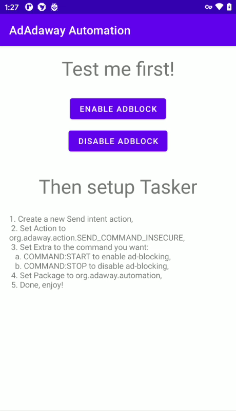

# AdAway Automation

This application has two purposes:

1. Demonstrate how to integration [AdAway](https://github.com/AdAway/AdAway/) with automation tools like Tasker,
2. Allow this kind of tools to work without requesting AdAway custom application permission.

## Goal

This application demonstrates how to integrate with AdAway using broadcasted intents.
For developers, the source code must be simple enough for developers to read and appropriate how to use it (See [MainActivity](app/src/main/java/org/adaway/automation/MainActivity.java)).
For users, it must allow to integrate with their favorite automation application without having to require them to use the AdAway custom permmission.

## Non goal

This application is not intended to be have a well polished user interface or be translated in a lot of language.
AdAway documentation should provide the related documentation instead.

## License

AdAway Automation is licensed under the GPLv3+.  
